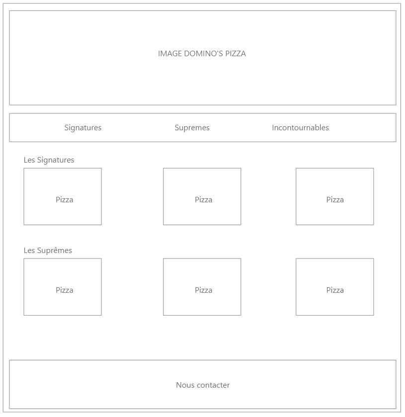
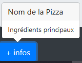
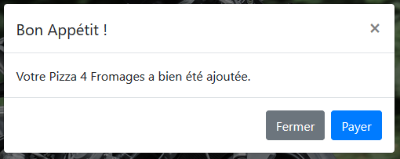

# TP Let's eat Pizzas !
> Le TP doit respecter les normes et les standards du WEB (ex. https://www.w3.org/ et https://checklists.opquast.com/fr/)

## Carte de pizzas chez Domino's
**BRAVO**, vos prestations ont été remarquées : Vous êtes chargés de créer la carte de pizzas pour **Domino's**.  

Voici le cahier des charges :
* Utilisation de l'image fournie (*bigPicture.jpg*) en tête du site.
* Une barre de navigation permettant de naviguer dans les différentes sections de la carte (*3 au total*).
* 3 Pizzas à mettre en avant dans chaque catégorie (*Signatures, Suprême, Incontournables*), elles devront être choisi sur le site https://www.dominos.fr/la-carte.
* 1 Footer avec un lien : Nous contacter.

Exemple de maquette :
  

*Vous devez vous rendre sur le site : https://www.dominos.fr/la-carte pour récupérer les images des pizzas.  
**Utilisation du site https://www.remove.bg/ pour **détourer** vos images.  

## Le sens du détail
Chaque pizza devra être présentée dans une **card** avec les éléments suivants :
* Le nom de la pizza.
* La photo de la pizza.
* Un prix sous forme de **badge**.
* 1 **bouton** "+ infos" qui ouvrira un **Popovers** contenant les ingredients.
* 1 **bouton** commander qui ouvrira une **Modal** indiquant que la pizza a bien été ajoutée.

ex. Card :  
 

ex. Prix :  
  

ex. Popovers :  
 

ex. Modal :  
 

## Structure du dossier
Le dossier de ce test sera composé de cette manière :
* index.html
* assets
    * img
        * images_du_site
    * css
        * style.css

## Les fameuses contraintes
* Utiliser majoritairement *des classes bootstrap* : **Votre site doit être responsive**.
* La navbar doit bénéficier de la fonction : **Scrollspy** (https://getbootstrap.com/docs/4.3/components/scrollspy/).
* Utilisation de l'anglais lors de la création de vos **class** et de vos **id**.
* Un code **propre** avec une belle **indentation** pour plus de lisibilité.

## Le mot de la **faim**
> Miam.
